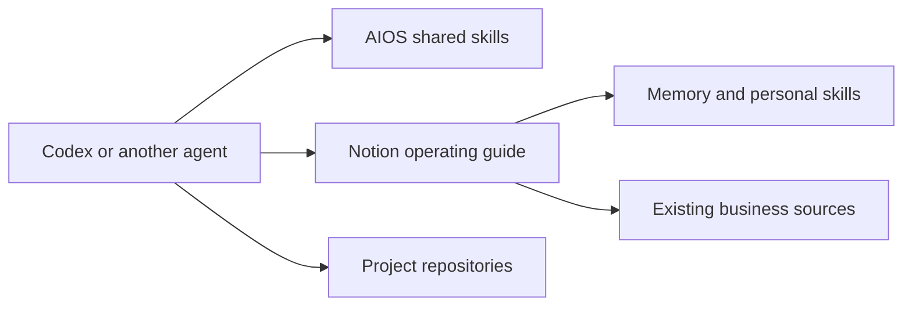

# Notion context preview

Status: isolated test branch; not a release or a migration of existing users.

The preview tests an optional Notion context home for solo founders and small
teams. AIOS remains a portable method/skill package. The customer's Notion guide
owns context routing, durable memory and personal skills. Native connections
access source systems; Notion is not a universal data ingestion layer.

## Accepted contract

Deliver an installed, reversible preview with real import/readback and fresh
session proof. Reuse the existing Business home and work destinations. Preserve
personal supporting files, existing access, source dates and verified recovery.
No merge, release, custom service, paid dependency or destructive data migration.
Do not publish private IDs, imported content or machine settings in this repo.

The existing file-home provider remains available. Only an explicit Notion
selection takes the new route. One thin host pointer is needed; there is no
required local .AIOS mirror, tailored company system prompt or background server.
Native skill page retrieval is supported; slash commands and complete package
export require actual host/API capability and are separately verified.

## Implementation and evidence

Setup, AIOS, Maintain Context, Manage Skills and Check dispatch to the selected
provider. The new Notion setup skill follows Notion's current setup guide with
AIOS ownership/recovery boundaries. Personal changes use native Notion skills;
shared methods remain in the plugin. A distinctly named local preview can be
staged from this branch without changing the production package identity.

Run affected source checks and independent review. Keep account-specific
migration/readback, native-session and rollback evidence in the private task
workspace. Record exact source revision and checks below before delivery.

## Ownership and recovery

The maintainer owns the plugin; the customer owns Notion content and permissions;
the harness owns scheduling, tool access and local registration. Task-time curation
is bounded to approved sources, not hidden chat history. A schedule requires an
explicit recurring-work request. Notion setup updates
are reviewed before adoption.

Rollback restores only recorded, unchanged preview registrations and the host
pointer. Notion pages and later work remain available. Cleanup may retire the
old home and registrations after a verified backup. Restore removed packages
through supported host controls and reconcile later knowledge before resuming
an archived home; do not overwrite an occupied destination. An earlier rollback
helper is not valid after changing its recorded package/home assumptions.

## Database and Space revision — 2026-10-03

The owner requested one readable Business home, Space-based navigation and
removal of the replaced setup. Reuse the existing knowledge and memory sources.
Show current knowledge, native personal skills and decisions through filtered
views; use Space metadata instead of copying records into separate page trees.
Keep coherent topics independently editable, preserving source identity and
dates. Native skill designation and supporting files are separate from a
catalog's Type property. Views organize information; they do not restrict access.

The host instruction is a conditional pointer: work needing owner context and
Notion writes read the guide; unrelated repository work stays local-first.
The guide supplies exact database/view identities, metadata-first selection,
current decisions and relevant personal skills. Shared scope is selected when
needed, not read wholesale. This revision adds no hook or custom context service.

Private recovery preserves the replaced host instructions, imported sources,
Notion structure and the retired owner home. Obsolete plugin registrations,
the old navigation hub and superseded policy are removed from active use only
after readback. Keep current recovery instructions alongside that backup.

Current verification is recorded separately at the end of this document;
the historical evidence below does not establish acceptance of later mutations.

## Historical verification — previews .1 through .3

Source base: `3b15f6a2dfef198702b532737e00e9a5fae9099f`.
Source subject SHA-256: `1b8132dd196fbd8d1192aa54987c87a284cbf0b5628db6acda0ebfeec4ad66d4`. This is SHA-256 of a sorted
JSON map (compact separators) of relative paths to file SHA-256 values for all
nonignored tracked/untracked source files, excluding this evidence document.

Passed on the revised source: package/link/isolation validation and per-skill
version comparison against origin/main; context-footprint ceilings (with the
additional conditional Notion route measured separately); layout, continuity,
documentation and skill-version rehearsals; whitespace validation. No test
ceiling was weakened. The native Skill Creator validator passed in a task-local test environment
with pinned PyYAML 6.0.3; no product/runtime dependency was added.

Private operator evidence records a verified original backup and private Git
remote equality, five representative file restores into a clean directory,
complete imported source-file inventory and a byte-identical attachment
roundtrip. Three personal skill pages and all supporting text/metadata were
read back; original skill snapshots remain recoverable. Native conversion
operations succeeded. A separate Notion UI readback showed all three names in
Library → Skills → Discover and the skill banner on a selected page. They remain
disabled for Notion's own Personal Agent; Codex uses the verified guide route.

A fresh Codex CLI session used the live guide, current business sources, one
personal skill and its reference. Another independent repository session read
only its local records. A changed synthetic Notion value was observed by a
fresh session. The initial tests used preview 0.18.0-notion.1. A second native session used
0.18.0-notion.2 for read-only Notion memory reconciliation and found stale
imported source routes; those were corrected and read back. A final fresh
0.18.0-notion.3 session verified the active provider, guide version, current
versus historical policy and retrieval of a second personal skill. The final
installed skill files match the source; cross-client UI behavior is not inferred.

Seven scoped recovery-helper tests passed, including later unrelated edits,
conflicting owned content, relative symlinks, later plugin-selection changes and
an interrupted-switch stop. Actual host rollback restored original pointers and
personal links; reactivation restored the active configuration bytes exactly.
A native daily heartbeat was created and read back. One bounded maintenance
pass verified unique memory keys and corrected an import-generated broken link;
a subsequent read required no new rows. Future scheduled runs are not claimed.

Independent source review found provider-routing/documentation gaps; they were
revised in the same branch. Independent source acceptance is PASS for the recorded source subject. A separate
review of the operator helper found a relative-link defect; it was fixed and
the affected synthetic and actual host recovery checks were repeated.
No merge, release, cross-harness runtime proof, UI-default proof, native complete
skill-package export or token/cost improvement is claimed.

## Historical verification — database and Space revision (.4)

Source base: `3457050a200a1573dab5835f89445972dfcd3735`.
Source subject SHA-256: `414f7cbd686e1aa9f196ada7facdd1c03c31f9c533b75cb4bd5ebc5c6257259c`, computed by the method above.
Package validation with per-skill versions against that base, context-footprint,
layout and continuity rehearsals, and whitespace checks passed. Test ceilings
were unchanged. An initial footprint failure was fixed by shortening the entry
wording while retaining the conditional owner-context boundary.

Independent source review found no actionable method/bridge defects. Its one
documentation finding was the ambiguous historical evidence label; the earlier
preview evidence is now explicitly historical. Independent correction review
returned PASS for the exact source subject above.

The installed preview `0.18.0-notion.4` matches all 170 staged package files.
Private operator evidence records rendered Space/Skills views, preserved native
skill banners and supporting children, and unique current knowledge/memory keys.
A fresh independent-project session computed its local result with no Notion
calls. A fresh owner-content session fetched the guide, selected metadata from
saved views, and read relevant topic pages, one personal skill and its reference.
The first owner run used plan-limited SQL; the owner guide was clarified to
prefer the existing quota-free view mode and that affected run was repeated.
Both runs were read-only. These observations prove the bounded retrieval path,
not future reliability, automatic slash-command discovery or token savings.

The earlier local home was retired with 32 matching file hashes. Obsolete
registrations and the outdated rollback helper are removed from active use;
the current recovery record preserves the original sources and explains safe
restoration after later edits. Native daily-maintenance configuration was read
back with the revised source scope; future executions remain unproven.

## Full-page navigation and task-time maintenance — 2026-10-05

The owner requested normal Notion navigation, with full-page Docs, native Skills
and Memory reached directly from Business home. Existing Docs content, native
template and properties stay useful. Move the same personal skill pages into a
canonical native Skills collection, preserving their method bodies, references,
attachments and automatic-use settings. Preserve the original home blocks and
repair exact view routes before retiring the replaced inline views.

This is an example mapping for this owner, not a mandatory three-database
template. Reuse suitable customer destinations and add only what is missing.
AIOS owns shared method releases; the owner owns context, decisions and personal
methods in Notion. Operational source systems and repositories keep their data.

Maintain Context owns durable correction/decision capture at natural task
checkpoints. No timer is necessary; the existing daily automation is paused.
The skill cannot observe other chats or guarantee freshness between tasks.
Setup alone does not authorize scheduling. The acceptance contract now checks
task-time correction and unchanged replay; schedule evidence is conditional.

Source base: `7c9372b284a52e5728030345a2a7662ddd63c6f4`.
Source subject SHA-256: `7e54511fc78ca926d5473a2598796b856d78060d1bf18df009e34e612701d8a4`,
computed by the method above. Package/per-skill version validation against that
base, context-footprint, documentation, layout and continuity rehearsals, and
whitespace checks passed without changing test ceilings. Independent review
identified an unnecessarily narrow standing-authority condition. The corrected
rule accepts either current task authorization or standing policy; independent
correction review returned PASS and verified the other reviewed files unchanged.

Preview `0.18.0-notion.5` is installed with all 170 files matching its stage.
Live readback verifies three full-page destinations, working Space views,
preserved Docs template, three native skill banners and their disabled personal
automatic-use settings. The skill methods, references and attachments are
unchanged; one native mention's displayed label normalized while retaining its
URL. The original home image, quote and unknown block remain intact. The two
replaced inline views are in recoverable trash; their guide routes are repaired.

Current decisions were updated in place. A fresh native session used the new
guide, metadata from saved views, relevant context, a personal content skill and
its manuscript reference. A separate Maintain Context replay fetched the
existing decision and made no write; independent readback confirmed unchanged
content and edit time. Memory retained ten unique keys. A fresh independent
project returned the correct local sum/count with no Notion calls. The native
automation is PAUSED. These are bounded observed runs, not a guarantee of
background freshness, complete package export or cross-harness behavior.
Account-specific records and recovery snapshots remain in the private task
workspace. No merge or release is included.

## Schema and native templates — 2026-10-05

The owner requested a clear reusable template, English setup labels and property
descriptions, and an explanation of identity, Spaces and skill activation. Spaces
remain central to one AIOS spanning brands/sub-brands; native project workspaces
do not require separate owner installations. Keep other metadata proportionate.

The conditional schema reference now defines the minimal roles, controlled Space
names and hierarchy, native template defaults, logical keys versus page identity,
and checks before managed records become Current. Existing equivalents and
document templates are reused. Relations are added only for meaningful links;
templates and prompts are not database integrity constraints. The owner's guide
holds actual values, IDs and parent/child view rules. Shared product source holds
the reusable method, not private configuration or company content.

Personal skill guidance explicitly distinguishes direct page-based Codex use from
Notion's Enable for me and package download. The former needs the existing host
bridge and Notion connection, not that button or a slash-command installation.

Source base: `a90e694092b5efc3f8cb9adb914acf97d1f1654a`.
Source subject SHA-256: `d0ec778d63cce5b1365704d9e029e1a9ed0533e4282b49df930049161131feaf`,
computed by the method above over 246 source files. Package/per-skill version
validation, context-footprint, documentation rehearsal and whitespace checks
passed. Independent review identified missing schema links from the direct
Check and Manage Skills routes. Both were corrected, and independent correction
review returned PASS for the exact subject, with other reviewed source unchanged.

Preview `0.18.0-notion.6` is installed with all 171 package files matching its
stage. Live readback preserves the same 24 Docs, three personal skills and ten
Memory records, with matching English Space options and unique nonempty logical
keys. Original document metadata and the default New doc template body remain.
The ten Memory records link to the exact affected Docs through a native relation.
One context page received a concurrent owner edit; it was preserved, and the
fresh-session test retrieved that newer decision.

Native UI tests applied New doc, Context, Source, Decision and Personal skill
templates to temporary drafts. Readback verified their bodies and intended
defaults, including Needs review and blank Key/Space. All five drafts are now in
recoverable trash. Connector template application had returned success while
leaving pages blank; the documented fallback keeps the same draft, checks for
delayed application, and uses native UI or the inspected structure. This is an
observed connection limitation, not a claim about all Notion integrations.

A fresh read-only Codex session used the installed .6 route, fetched the guide,
queried saved views and selected three relevant context pages and the native
content skill. It returned the owner's latest headline, explained Notion AI
Enable/download versus Codex page use, and named the correct creation checks.
The trace contains only three read-only shell calls and thirteen read-only
Notion calls; no writes. This verifies one bounded journey, not automatic skill
discovery, universal connector behavior or future freshness. Daily maintenance
remains paused. Account-specific snapshots and rendered UI proof stay private;
no merge, public workspace template, package release or deployment is included.
