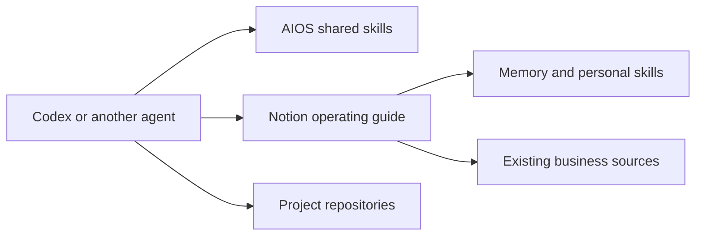

# Notion context preview

Status: isolated test branch; not a release or a migration of existing users.

The preview tests an optional Notion context home for solo founders and small
teams. AIOS remains a portable method/skill package. The customer's Notion guide
owns context routing, durable memory and personal skills. Native connections
access source systems; Notion is not a universal data ingestion layer.

## Accepted contract

Deliver an installed, reversible preview with real import/readback and fresh
session proof. Reuse the existing Business home and work destinations. Preserve
personal supporting files, existing access, source dates and the original setup.
No merge, release, custom service, paid dependency or destructive data migration.
Do not publish private IDs, imported content or machine settings in this repo.

The existing file-home provider remains available. Only an explicit Notion
selection takes the new route. One thin host pointer is needed; there is no
required local .AIOS mirror, tailored company system prompt or background server.
Native skill page retrieval is supported; slash commands and complete package
export require actual host/API capability and are separately verified.

## Implementation and evidence

Setup, AIOS, Maintain Context, Manage Skills and Check dispatch to the selected
provider. The new Notion setup skill follows Notion's current setup guide with
AIOS ownership/recovery boundaries. Personal changes use native Notion skills;
shared methods remain in the plugin. A distinctly named local preview can be
staged from this branch without changing the production package identity.

Run affected source checks and independent review. Keep account-specific
migration/readback, native-session and rollback evidence in the private task
workspace. Record exact source revision and checks below before delivery.

## Ownership and recovery

The maintainer owns the plugin; the customer owns Notion content and permissions;
the harness owns scheduling, tool access and local registration. Daily curation
is bounded to approved sources, not hidden chat history. Notion setup updates
are reviewed before adoption.

Rollback restores only recorded, unchanged preview registrations and the host
pointer. Notion pages and later work remain available. The old owner home stays
inactive during the trial, available for recovery; resuming it requires
reconciliation of decisions made since cutover.

## Verification — 2026-10-03

Source base: `3b15f6a2dfef198702b532737e00e9a5fae9099f`.
Source subject SHA-256: `1b8132dd196fbd8d1192aa54987c87a284cbf0b5628db6acda0ebfeec4ad66d4`. This is SHA-256 of a sorted
JSON map (compact separators) of relative paths to file SHA-256 values for all
nonignored tracked/untracked source files, excluding this evidence document.

Passed on the revised source: package/link/isolation validation and per-skill
version comparison against origin/main; context-footprint ceilings (with the
additional conditional Notion route measured separately); layout, continuity,
documentation and skill-version rehearsals; whitespace validation. No test
ceiling was weakened. The native Skill Creator validator passed in a task-local test environment
with pinned PyYAML 6.0.3; no product/runtime dependency was added.

Private operator evidence records a verified original backup and private Git
remote equality, five representative file restores into a clean directory,
complete imported source-file inventory and a byte-identical attachment
roundtrip. Three personal skill pages and all supporting text/metadata were
read back; original skill snapshots remain recoverable. Native conversion
operations succeeded. A separate Notion UI readback showed all three names in
Library → Skills → Discover and the skill banner on a selected page. They remain
disabled for Notion's own Personal Agent; Codex uses the verified guide route.

A fresh Codex CLI session used the live guide, current business sources, one
personal skill and its reference. Another independent repository session read
only its local records. A changed synthetic Notion value was observed by a
fresh session. The initial tests used preview 0.18.0-notion.1. A second native session used
0.18.0-notion.2 for read-only Notion memory reconciliation and found stale
imported source routes; those were corrected and read back. A final fresh
0.18.0-notion.3 session verified the active provider, guide version, current
versus historical policy and retrieval of a second personal skill. The final
installed skill files match the source; cross-client UI behavior is not inferred.

Seven scoped recovery-helper tests passed, including later unrelated edits,
conflicting owned content, relative symlinks, later plugin-selection changes and
an interrupted-switch stop. Actual host rollback restored original pointers and
personal links; reactivation restored the active configuration bytes exactly.
A native daily heartbeat was created and read back. One bounded maintenance
pass verified unique memory keys and corrected an import-generated broken link;
a subsequent read required no new rows. Future scheduled runs are not claimed.

Independent source review found provider-routing/documentation gaps; they were
revised in the same branch. Independent source acceptance is PASS for the recorded source subject. A separate
review of the operator helper found a relative-link defect; it was fixed and
the affected synthetic and actual host recovery checks were repeated.
No merge, release, cross-harness runtime proof, UI-default proof, native complete
skill-package export or token/cost improvement is claimed.
